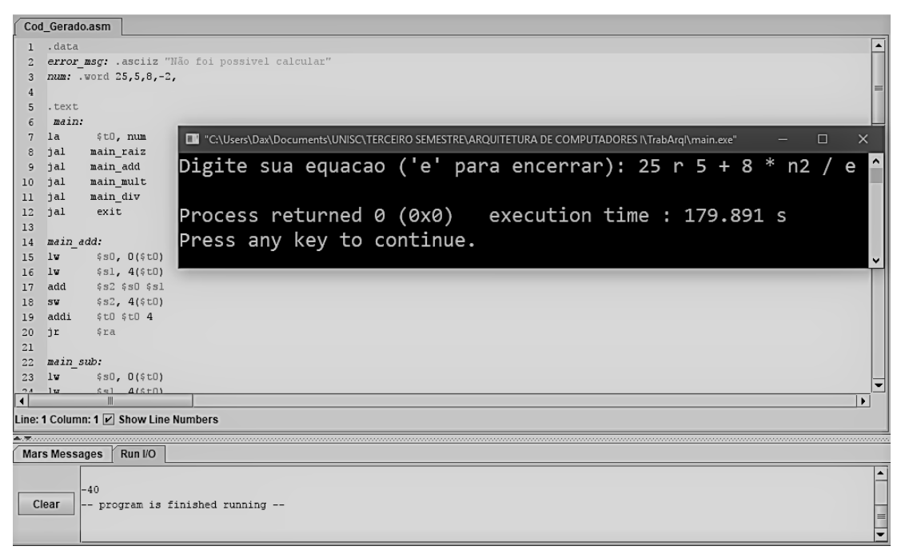

# Calculadora em Assembly

## Sobre

O projeto consite em um gerador de código para uma calculadora em Assembly que realiza as funções de soma, subtração, multiplicação, divisão, potenciação, raiz quadrada, fatorial e fibonacci.

No arquivo Documentação.pdf é possível encontrar maiores informações sobre a execução do projeto.

## Status

Considero necessária a refatoração do código em C++

## Tecnologias utilizadas
- CodeBlocks
- C++
- Assembly
